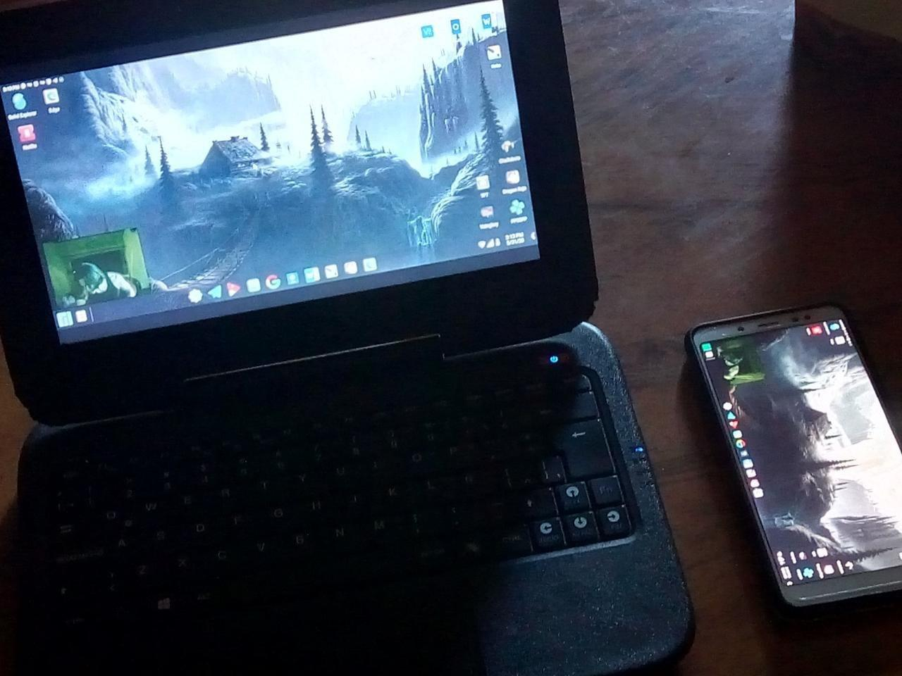

## Instructions:
* In the batch script replace `DEVICE_ID` with the ID/IP of your device.
* In Taskbar Launcher, you must activate "Replace Home Screen"
## Useful Notes: 
* You can change render driver between opengl and direct3d on `--render-driver=direct3d`
* If you got lag issues, try to play with `-m1360` and `-b10M`
* For more shortcuts, check scrcpy repository
## More Information:
* [Telegram Group](https://t.me/AndroidDesktop)
* [Demostration video](https://youtu.be/n6CgGz_69eI)
## This batch script uses the following elements:
* [Scrcpy](https://github.com/Genymobile/scrcpy)
* [Taskbar Launcher](https://github.com/farmerbb/Taskbar)
* [Niagara Launcher](https://github.com/8bitPit/Niagara-Issues)
* [Null Keyboard](https://play.google.com/store/apps/details?id=com.wparam.nullkeyboard&hl=en)
* [Gboard](https://play.google.com/store/apps/details?id=com.google.android.inputmethod.latin&hl=en)
